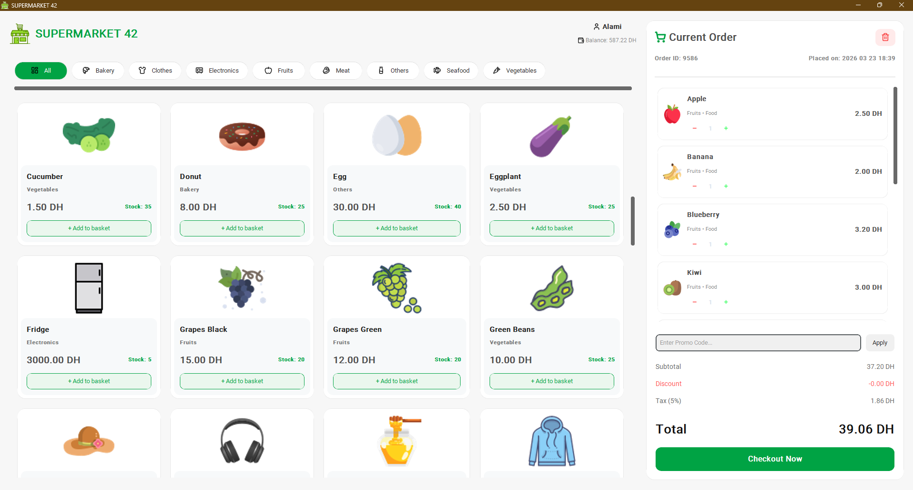
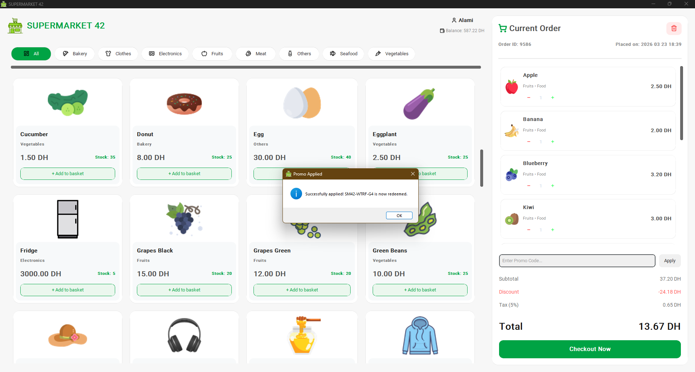
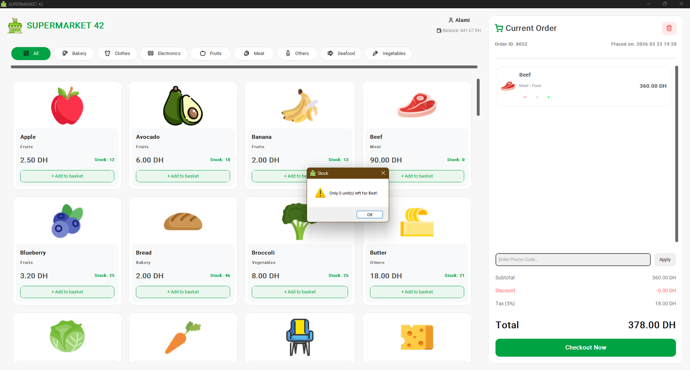
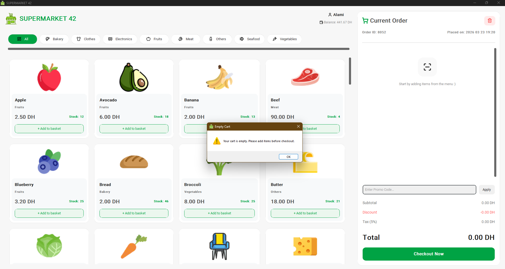
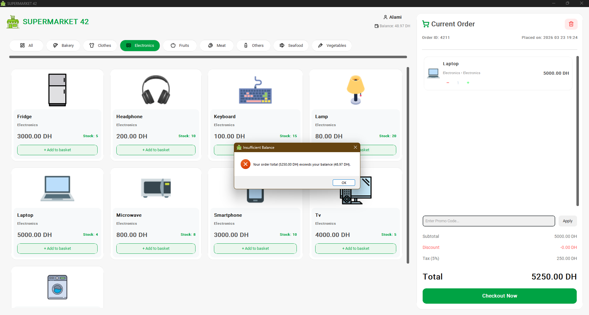
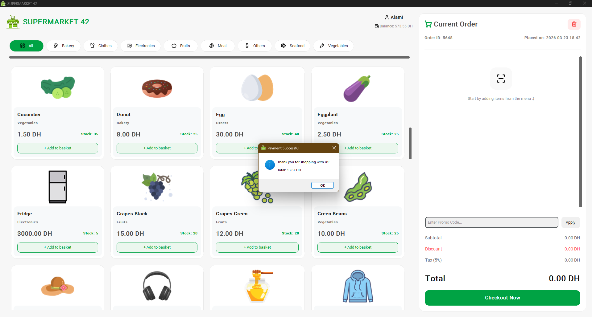
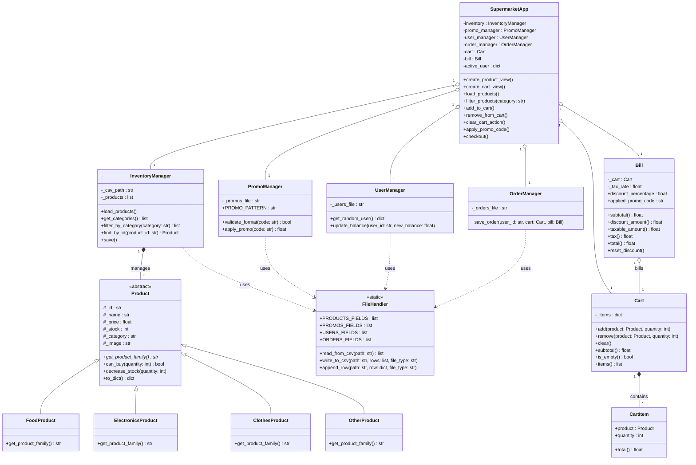

<h1 align="center">
Supermarket 42 - POS System
</h1>


<p align="center">
   &nbsp;&nbsp;
   &nbsp;&nbsp;
   &nbsp;&nbsp;
   &nbsp;&nbsp;
   &nbsp;&nbsp;
  
</p>

A complete desktop graphical application for a supermarket checkout system built with Python and CustomTkinter. It leverages clean architecture separating the data models, the business logic services, and the Graphical User Interface (GUI).

> ⚠️ **Work in Progress**: This project is currently under active development. Features and functionality are subject to change.

## Table of Contents
- [Table of Contents](#table-of-contents)
- [Preview of the application interface and user experience:](#preview-of-the-application-interface-and-user-experience)
  - [Main Interface](#main-interface)
  - [Error Handling \& Edge Cases](#error-handling--edge-cases)
  - [Transaction Completion](#transaction-completion)
- [OOP Concepts Used](#oop-concepts-used)
- [Project File Structure](#project-file-structure)
- [Prerequisites \& How to Run](#prerequisites--how-to-run)
  - [Requirements](#requirements)
  - [Running the App](#running-the-app)
- [Detailed Architecture \& Flow](#detailed-architecture--flow)
  - [1. Application Flow (Start to End)](#1-application-flow-start-to-end)
  - [2. Models (`models/` folder)](#2-models-models-folder)
  - [3. Services (`services/` folder)](#3-services-services-folder)
  - [4. Relationships Between Classes](#4-relationships-between-classes)
- [UML Class Diagram](#uml-class-diagram)

---

## Preview of the application interface and user experience:
The screenshots below demonstrate the main shopping interface, error handling for edge cases, and the final checkout receipt.

### Main Interface
| Standard Cart | Cart with Promo Code Applied |
| :---: | :---: |
|  |  |

### Error Handling & Edge Cases
| Out of Stock | Empty Cart | Insufficient Funds |
| :---: | :---: | :---: |
|  |  |  |

### Transaction Completion
**Successful Checkout Receipt** <br>


---

## OOP Concepts Used

This project was built adhering heavily to Object-Oriented Programming (OOP) paradigms to keep the codebase modular, extensible, and clean:

*   **Encapsulation**: Data states like `Product` inventory, `Bill` totals, and `Cart` contents are stored in protected attributes (using the `_` prefix) and accessed exclusively through controlled properties and methods (e.g., `can_buy()` and `decrease_stock()`), preventing invalid external modification.
*   **Inheritance**: Specific product classes (`FoodProduct`, `ElectronicsProduct`, `ClothesProduct`, and `OtherProduct`) branch out from the parent base `Product` class, inheriting its base characteristics like ID, name, price, and stock manipulation methods.
*   **Abstraction**: The main `Product` class is an abstract base class (using the `abc` module). It is never instantiated directly. It defines an abstract method `get_product_family()` that forces all subclasses to provide their own specific logic.
*   **Polymorphism**: The `InventoryManager` and `GUI` iterate through lists of general `Product` instances. When methods like `get_product_family()` or `price` properties are called, the code behaves seamlessly without needing to check the exact type of product it's interacting with.

---

## Project File Structure

```text
supermarket/
│
├── main.py                     # Entry point of the application
├── readme.md                   # Project documentation
│
├── assets/                     # All external persistent files
│   ├── db/                     
│   │   ├── inventory/          
│   │   │   └── products.csv    # Current product stock & data
│   │   ├── orders/             
│   │   │   └── orders.csv      # Logged completed transactions
│   │   ├── promos/             
│   │   │   └── promos.csv      # Valid and used discount codes
│   │   └── users/              
│   │       └── users.csv       # User mock profiles and balances
│   └── images/                 # GUI images (icons, categories, logos)
│
├── gui/                        # View & Controller layer
│   └── app.py                  # CustomTkinter interface class
│
├── models/                     # Data structures
│   ├── bill.py                 # Calculates numeric totals and taxes
│   ├── cart.py                 # Holds active session items
│   └── product.py              # Parent and child product classes
│
└── services/                   # Business logic and File I/O
    ├── file_handler.py         # Static utility for CSV operations
    ├── inventory_manager.py    # Memory holder for available items
    ├── order_manager.py        # Validates and stores receipts
    ├── promo_manager.py        # Parses and validates discount actions
    └── user_manager.py         # Loads profiles and deducts money
```

---

## Prerequisites & How to Run

### Requirements
You need Python 3 installed on your system.
Install the required external packages via `pip`:

```bash
pip install customtkinter pillow
```

### Running the App
Start the system by launching the `main.py` entry point from within the root folder:

```bash
python main.py
```

---

## Detailed Architecture & Flow

### 1. Application Flow (Start to End)
*   **Startup (`main.py`)**: The application entry point. It initializes the `InventoryManager`, loading all products from the `products.csv` database into memory. It then creates the main `SupermarketApp` GUI window, passing the loaded inventory to it, and starts the UI event loop (`mainloop`).
*   **Initialization (`app.py`)**: The GUI configures its layout, loads required image assets, and initializes all the core session components: `Cart` (shopping basket), `Bill` (pricing calculations), `PromoManager` (discounts), `UserManager` (customer profiles), and `OrderManager` (transaction logger). It randomly extracts a user from `users.csv` to heavily simulate an active logged-in customer session (displaying their name and wallet balance in the corner).
*   **Shopping Experience**: 
    *   The main window displays an interactive grid of product cards.
    *   Users can filter listed products by clicking category buttons at the top navigation bar (e.g., "Bakery", "Electronics", "All").
    *   Users click "+ Add to basket" on a product card. This logs the item to the `Cart`, updates the stock integer displayed on the card dynamically, and recalculates the `Bill` subtotals in the sidebar.
*   **Cart & Checkout Management**:
    *   The right side of the screen visualizes the active cart. Users can increment/decrement exact target quantities or clear the cart entirely in one click.
    *   Users can type a discount code into the promo field. If perfectly valid (e.g., matching the `SM42-XXXX-XX` regex) and currently unused in `promos.csv`, an exact discount amount is applied to the active `Bill`.
    *   When the user clicks "Checkout", the system verifies two final states: the cart is not empty, and the dynamic `user_balance` is greater than or equal to the `Bill.total`.
*   **Transaction Completion**:
    *   If successful, the `InventoryManager` permanently deducts the successfully purchased items and writes the new stock limits back to `products.csv`.
    *   The `UserManager` subtracts the `total` cost from the user's electronic balance and updates `users.csv`.
    *   The `OrderManager` strings together the receipt data and appends it to `orders.csv`.
    *   The `PromoManager` updates the consumed promo code as 'used' in `promos.csv`.
    *   The cart and GUI values are safely cleared, popping up an alert reporting successful completion to the user.

### 2. Models (`models/` folder)
Models define the core rigid data structures of the application.

*   **`Product` (Abstract Base Class)**: Represents a single isolated purchase item.
    *   **Attributes**: `_id`, `_name`, `_price`, `_stock`, `_category`, `_image`.
    *   **Methods**:
        *   `can_buy(quantity)`: Evaluates if the requested capacity is strictly available in the database pool.
        *   `decrease_stock(quantity)`: Drops the internal count permanently.
        *   `to_dict()`: Maps object items to a native dictionary format so CSV logic can consume it.
        *   `get_product_family()`: Required stub forcing distinct types.
    *   **Subclasses**: `FoodProduct`, `ElectronicsProduct`, `ClothesProduct`, `OtherProduct`. They inherit from `Product` and return their literal family type via the abstract method string literal (e.g. "Food").
*   **`CartItem`**: Bundles a particular target payload together.
    *   **Attributes**: `product` (reference proxy mapped to a `Product` Object), `quantity` (Current requested purchase size).
    *   **Properties**: `total` (Dynamically yields `price` * `quantity`).
*   **`Cart`**: Encompasses grouped items in processing mode.
    *   **Attributes**: `_items` (A native set mapping mapped distinct product IDs to `CartItems`).
    *   **Methods**: `add()`, `remove()`, `clear()`, `subtotal()`, and `is_empty()`.
*   **`Bill`**: Calculates exact floating numbers over an associated cart list.
    *   **Attributes**: `_cart`, `_tax_rate` (Baseline static 5%), `discount_percentage`, `applied_promo_code`.
    *   **Properties**: Evaluates realtime numbers resolving `subtotal`, `discount_amount`, `taxable_amount`, `tax`, and grand computed `total`.

### 3. Services (`services/` folder)
Services abstract and isolate business application logic interacting with flat files and state states.

*   **`FileHandler`**: A single central static class running direct CSV access procedures.
    *   **Methods**: `read_from_csv(path)`, `write_to_csv(path)`, and `append_row(path)`.
*   **`InventoryManager`**: Holds global tracking of catalog elements.
    *   **Methods**: `load_products()`, `filter_by_category()`, and `save()`.
*   **`UserManager`**: Orchestrates consumer interactions.
    *   **Methods**: `get_random_user()` (Hooks generic entry details), and `update_balance()` (Manages money value mutations).
*   **`PromoManager`**: Regulates string inputs against valid discounts.
    *   **Methods**: `validate_format()` (Regex operations), and `apply_promo()` (Deduces active statuses).
*   **`OrderManager`**: Validates post-transaction history updates to records.
    *   **Methods**: `save_order()`.

### 4. Relationships Between Classes
*   **Controller (`SupermarketApp`)**: Maps visually as a central Controller aggregating `Cart` and `Bill` states and sending data signals outward towards the `InventoryManager`, `UserManager`, `PromoManager`, and `OrderManager` services.
*   **Composition / Aggregation**: `Bill` wraps exactly one active `Cart`. `Cart` owns multiple runtime instances of `CartItem`. `CartItem` wraps exact `Product` locations.
*   **Separation of Concerns**: High-level Domain Controllers like Manager classes NEVER invoke python's intrinsic file descriptors. File handling is completely partitioned and deferred out directly toward the `FileHandler` generic tools.

---

## UML Class Diagram



<p align="center">Thanks for stopping by and taking a peek at my work!</p>
